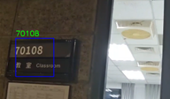

# Image_Recognition_By_Haar_Cascade
The purpose of this project is to allow the camera to detect the target



## Demo
[Click here to watch the demo video](https://youtu.be/wNfMEHVkqjk)

## How to run
```bash
opencv_traincascade -data classifier -vec positives.vec -bg negatives.txt -numPos 1000 -numNeg 500 -numStages 10 -w 24 -h 24


